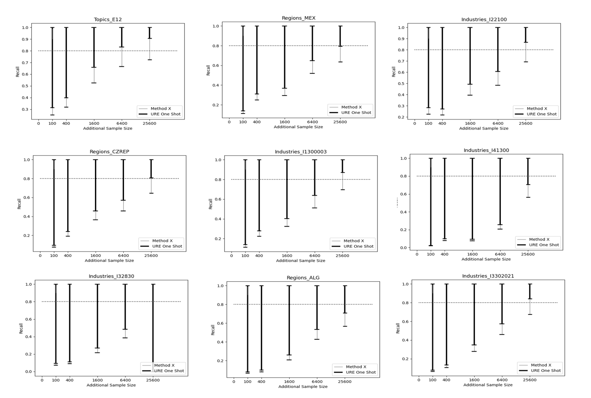

## Confidence Sequences for Evaluating One-Phase Technology-Assisted Review (Accepted at ICAIL 2023)
---
This repository is the official implementation of Confidence Sequences for Evaluating One-Phase Technology-Assisted Review. [this should be a link to the ArXiv paper]

We present a new evaluation approach for one-phase TAR workflows based on confidence sequences. Although the method is expensive in terms of sample size, it is plausible for large-scale reviews and has many opportunities for improvement.

We believe that our approach will be valuable to researchers and practitioners interested in evaluating the effectiveness of one-phase TAR workflows in the context of eDiscovery.

### Requirements
---

### Results
---

