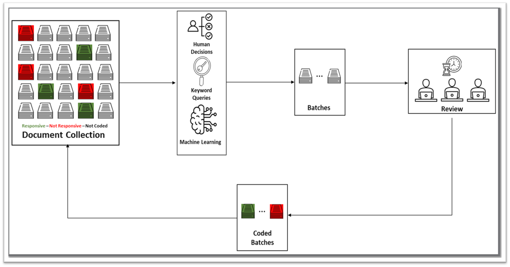

## Confidence Sequences for Evaluating One-Phase Technology-Assisted Review (Accepted at ICAIL 2023)
---
![Redgrave Data] (22-02 Redgrave_Data_ALT_Horizontal_FC.jpg "Redgrave Data")
This repository is the official implementation of Confidence Sequences for Evaluating One-Phase Technology-Assisted Review. [this should be a link to the ArXiv paper]

We present a new evaluation approach for one-phase TAR workflows based on confidence sequences. Although the method is expensive in terms of sample size, it is plausible for large-scale reviews and has many opportunities for improvement.

We believe that our approach will be valuable to researchers and practitioners interested in evaluating the effectiveness of one-phase TAR workflows in the context of eDiscovery.

**Diagram of One-Phase TAR Process**

### Requirements
---

### Results
---
**95% two-sided confidence intervals on recall for OneShot/URE (dark) vs. our method (light)**

 vs. our method (light) for post-review coding
effort from 100 to 25600 documents")

**95% lower one-sided confidence intervals on recall for OneShot/URE (dark) vs. skewed intervals for our method (light)**

 vs. skewed intervals for our method (light)")

